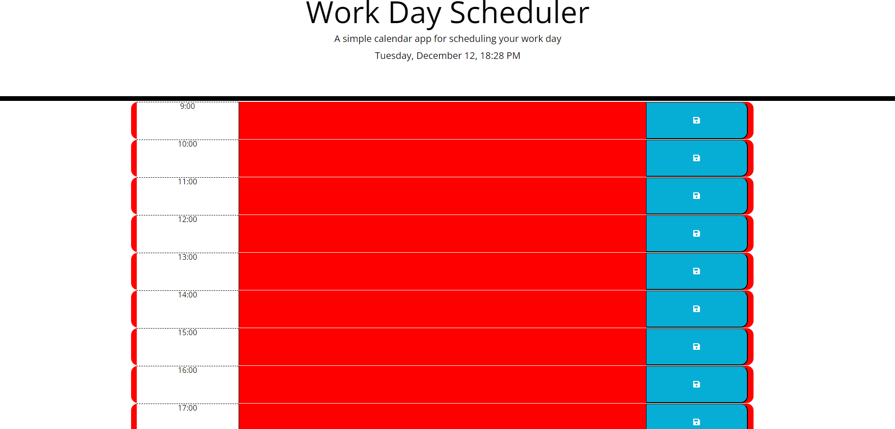

# Work Day Scheduler

## Description
Work Day Scheduler is a simple, intuitive web application designed to help users manage their workday schedule. It features a user-friendly interface where users can enter and save events for each hour of the business day. The application color-codes time blocks based on the current time, helping users easily distinguish between past, present, and future tasks.

## Features
- Easy-to-use interface for scheduling events.
- Time blocks color-coded for past, present, and future hours.
- Save functionality for each time block.
- Utilizes local storage to persist data.

## Installation
To install the Work Day Scheduler, follow these steps:
1. Clone the repository or download the source code.
2. Ensure you have a modern web browser installed, such as Google Chrome, Firefox, or Safari.
3. Open the `index.html` file in your web browser.

## Usage
To use the Work Day Scheduler:
1. Open the application in your web browser.
2. Click on a time block to enter an event.
3. Click the save button on the right side of the time block to save the event.
4. The scheduler automatically highlights past, present, and future hours using different colors.

## Contributing
Contributions to the Work Day Scheduler are welcome. Please follow these steps to contribute:
1. Fork the repository.
2. Create a new branch for your feature.
3. Add your changes and commit them.
4. Push the branch and open a pull request.

## Screenshots 

## Deployment link
https://georgeionite.github.io/Work-Day-Scheduler/

## Contact
For any questions or contributions, please contact Marcel George Ionite at george_ionite@yahoo.com.

